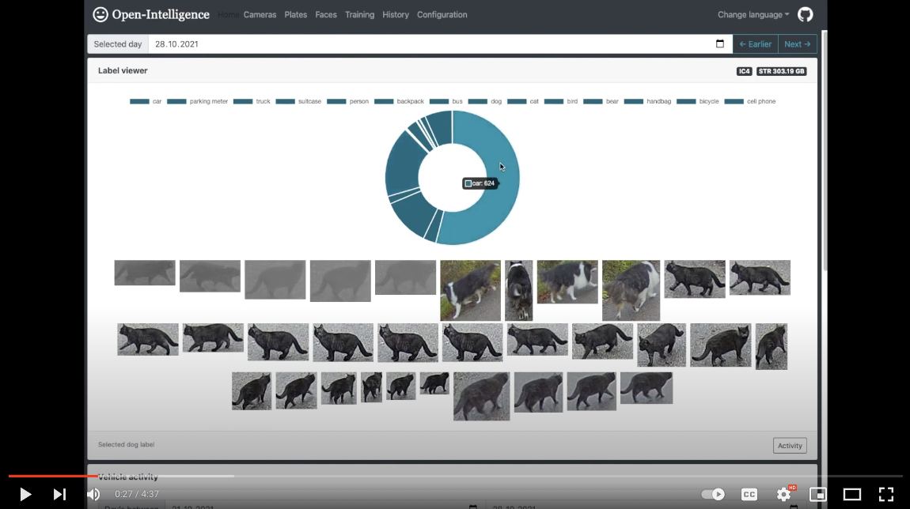
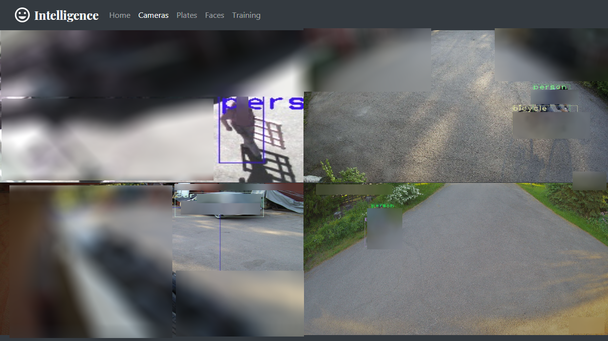
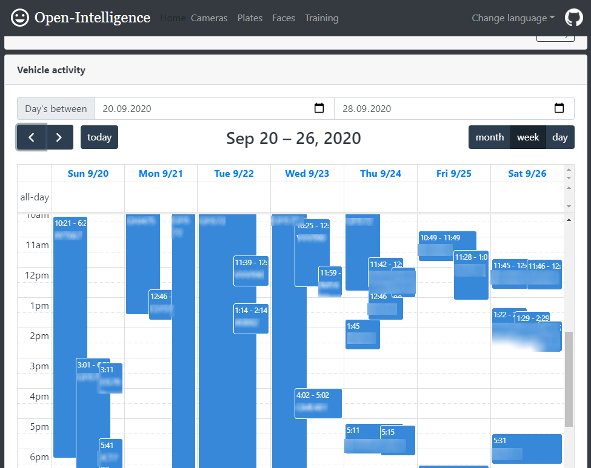
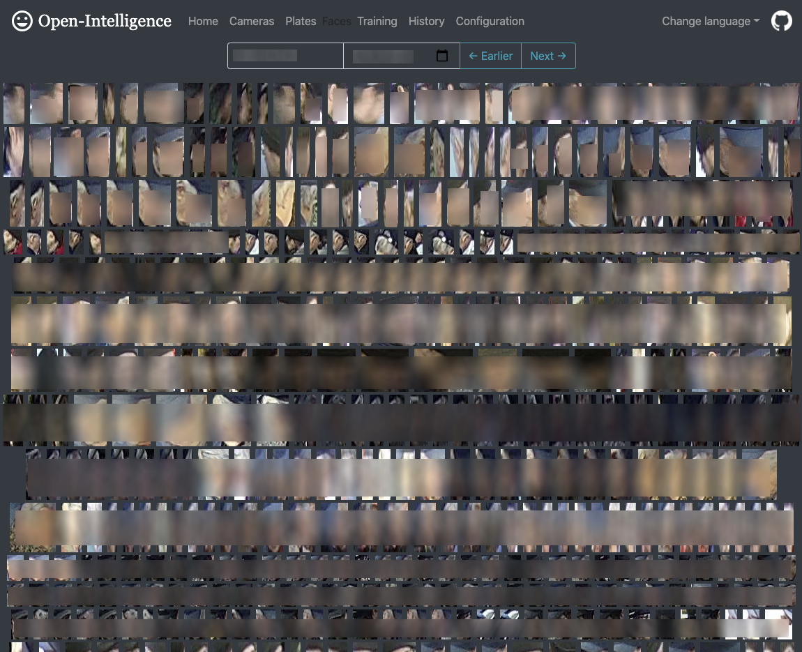
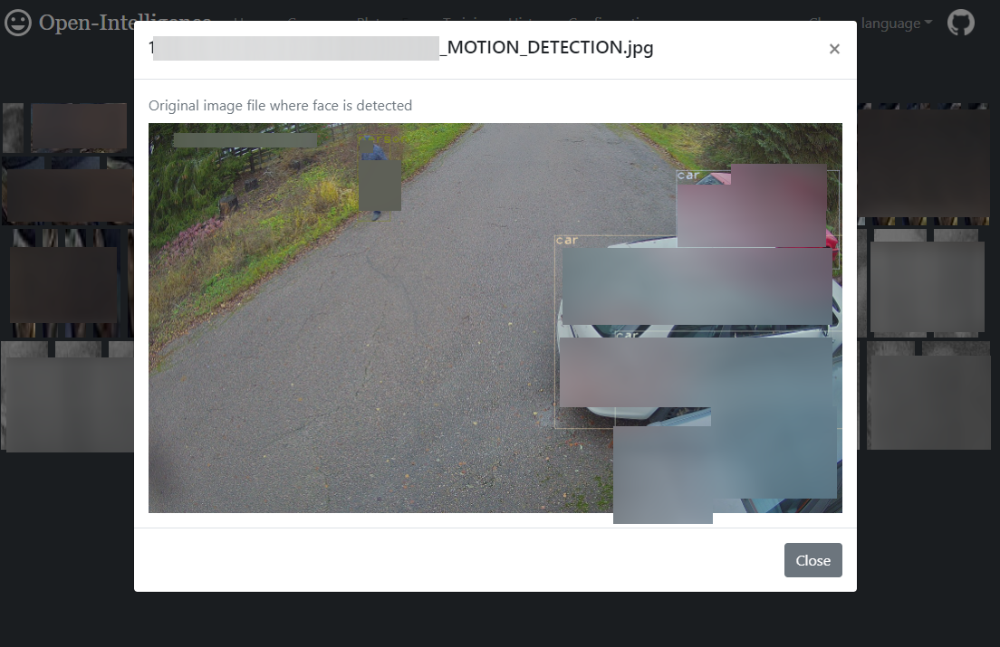

Open Intelligence processes <b>any camera</b> motion triggered images and sorts seen objects using Yolo, it provides
easy to use front end web interface with rich features so that you can have up to date intel what is the current status
on your property. Open Intelligence uses license plate detection (ALPR)
to detect vehicle plates and face detection to detect people faces which then can be sorted into person folders and then
can be trained so that Open Intelligence can try to identify seen people. All this can be done from front end interface.

Open Intelligence uses super resolution neural network to process super resolution images for improved license plate
detection.

Project goal is to be useful information gathering tool to provide data for easy property monitoring without need for
expensive camera systems because any existing cameras are suitable.

I developed this to my own use because were tired to use existing monitoring tools to go through recorded video. I
wanted to know what has been happening quickly.

Open Intelligence is meant to be run with Docker.


Click below to watch promo video
[](https://www.youtube.com/embed/ox5i6xCZaaA)

Cameras view             |  Plate calendar
:-------------------------:|:-------------------------:
   |  

* It's possible to make cameras view play heard microphone sounds.
* Calendar view can open full source detection image by clicking car plate event.

Face wall             |  Face wall source dialog
:-------------------------:|:-------------------------:
   |  

* Face wall is one of the creepiest features.
* You can go trough pile of faces and by clicking them, you can see source image.

-------------------------------------------------------------

Table of contents
=================

* [Environment](#environment)
* [Installing with Docker](#installing-with-docker)
    * [Install database](#1-install-database)
    * [Install docker](#2-install-docker)
    * [Clone repository](#3-clone-this-repository-code)
    * [Get models](#4-get-models)
    * [Configure](#5-configure)
    * [Verify time zone](#6-verify-your-timezone-linux-server-distro-case)
    * [Storage configuration](#7-configure-storage)
    * [Run apps](#8-run)
    * [Configuration from UI](#9-configuration-from-ui)
* [Update to the latest version](#updating-to-the-latest-version)
* [Process drawing](#process-drawing)
* [Project folder structure](#project-folder-structure)
* [Python Apps](#python-apps)
    * [App.py](#app)
    * [StreamGrab.py](#streamgrab)
    * [SuperResolution.py](#superresolution)
    * [InsightFace.py](#insightface)
    * [SimilarityProcess.py](#similarityprocess)
* [Installing manually](#installing-manually)
    * [Api side](#api-side)
    * [Build react front end](#build-react-front-end)
    * [Python side (Windows)](#python-side)
* [Multi node support](#multi-node-support)
* [Cuda GPU Support](#cuda-gpu-support)
* [Postgresql notes](#postgresql-notes)
* [Openalpr notes](#openalpr-notes)
* [Front end development](#front-end-development)
* [Troubleshooting](#troubleshooting)
* [Authors](#authors)
* [License](#license)

Environment
============

Everything can be installed on one server or to separate servers meaning that database is at server one, python
application at server two and api hosting at server three. Processes must have access to output storage containing 
processed image result files.


Installing with Docker
============
This section has step-by-step installation tutorial to get started with Docker based installation. Docker way of running
Open-Intelligence is not going to limit you for only Docker, you can still run for example api, front-end, app.py,
similarity processes with Docker and have separate GPU enabled machine for super resolution and insightface processes.

### 1. Install database

Download [PostgreSQL](https://www.postgresql.org/) and install it on any machine you want on your network. Look over
with search engine how to make it available on local network devices if you are installing it on a different machine
than what is running Docker images.

### 2. Install Docker

If you don't already have, go to [https://docs.docker.com/get-docker/](https://docs.docker.com/get-docker/) and follow
their instructions.

### 3. Install Docker Compose

If you don't already have, go to [https://docs.docker.com/compose/install//](https://docs.docker.com/compose/install//) and follow
their instructions.

### 4. Clone this repository code

Use any version control tool to clone this repository code. I recommend using any git based tool so that you can
checkout latest code and by recommend, I mean don't download it as "offline" zip file.

Using git from shell:

```shell script
git clone https://github.com/norkator/open-intelligence.git
```

### 5. Get models

Get models here https://drive.google.com/file/d/1dSJuxpwSFfF7SIJg8NMKG5yCIG9CHQKw/view?usp=sharing
unzip models into open intelligence `/python/models` folder.

### 6. Configure

1. Rename `docker-compose.yml_tpl` into `docker-compose.yml` and fill in your environment variables which pretty much
   are database configuration.

### 7. Verify your timezone (linux server distro case)

https://github.com/norkator/open-intelligence/wiki/Linux-notes#ensure-your-timezone-is-right

### 8. Configure storage
On linux machine configuring storage steps are:

Open docker-compose.yml and tweak all volume configs
```yaml
    volumes:
      - ./python/:/app
      - /Users/<user-name>/Desktop/camera_root:/input
      - /Users/<user-name>/Desktop/output:/output_test
```
where first part `/Users/<user-name>/Desktop/camera_root` is your path to your host machine folder. 
Same with another output folder path. Its just some folder in your machine where you want all open intelligence
output files to be stored.

That latter part like `:/input` and `:/output_test` is how python process sees paths in container side. 
It does not affect any way to your actual mounted folders so better not change these. 

More on this article: https://github.com/norkator/open-intelligence/wiki/Configuring-storage

### 9. Run

1. Run `docker-compose up` in root of this project and let magic happen.
2. Open `http://localhost:3000/` and you should see Open Intelligence front page. Hopefully.


### 10. Configuration from UI

1. Go to Configuration page and fill in your details. Content settings are explained at
   configuration page.
2. Run `docker-compose up` again so that changes takes effect in python side.


Updating to the latest version
============

Run at root of this project:

```shell
git fetch
git pull
docker-compose build
docker-compose up
```


Process drawing
============
Overall process among different python processes for Open Intelligence.


Project folder structure
============

    Default folders
    .
    ├── api                      # Backend service for frontend webpage
    ├── docs                     # Documents folder containing images and drawings
    ├── front-end                # Web interface for this project
    ├── python                   # Python backend applications doing heavy lifting
      ├── classifiers            # Classifiers for different detectors like faces        
      ├── libraries              # Modified third party libraries
      ├── models                 # Yolo and other detector model files
      ├── module                 # Python side application logic, source files 
      ├── objects                # Base objects for internal logic
      ├── scripts                # Scripts to ease things      

Python Apps
============
This part is explaining in better detail what each of base python app scripts is meant for. Many tasks are separated for
each part. App.py is always main process, the first thing that sees images.

App
-----

* File: `App.py`
* Status: *Mandatory*
* This is main app which is responsible for processing input images from configured sources.
* Cluster support: Yes.

StreamGrab
-----

* File: `StreamGrab.py`
* Status: *Optional*
* If you don't have cameras which are outputting images, you can configure multiple camera streams using this stream
  grabber tool to create constant input images.
* Cluster support: No.

SuperResolution
-----

* File: `SuperResolution.py`
* Status: *Optional*
* This tool processes super resolution images and run's new detections for these processed sr images. This is no way
  mandatory for process.
* Cluster support: No.
* Mainly meant for improved license plate detection.
* Testing: use command `python SuperResolutionTest.py --testfile="some_file.jpg"` which will load image by given name
  from `/images` folder.

InsightFace
-----

* File: `InsightFace.py`
* Status: *Optional*
* Process faces page 'face wall' images using InsightFace retina model.
* Cluster support: No.

SimilarityProcess
-----

* File: `SimilarityProcess.py`
* Status: *Optional*
* Compares current running day images for close duplicates and deletes images determined as duplicate having no higher
  value (no detection result). Processes images in one hour chunks.
* Cluster support: No.
* Process is trying to save some space.


Installing manually
============
This is no longer recommended. Using docker method is much better.

Terminology for words like API side and Python side:

* "API Side" is `/api` folder containing node api process `intelligence.js`.
* "Python side" is `/python` folder containing different python processes.

See [Project folder structure](#project-folder-structure)  for more details about folders.

API side
-----

1. Go to `/api` folder and run `npm install`
2. Install PostgreSQL server: https://www.postgresql.org/
    * Accessing postgres you need to find tool like pgAdmin which comes with postgres, command line or some IDE having
      db tools.
3. Rename `.env_tpl` to `.env` and fill details.
4. Run `intelligence-tasks.js` or with PM2 process manager `pm2 start intelligence-tasks.js`.
5. Run `node intelligence.js` or with PM2 process manager `pm2 start intelligence.js -i 2`.
6. Running these NodeJS scripts will create database and table structures, if you see error run it again.
7. Go to `/front-end` folder and rename `.env_tpl` to `.env`.
8. At `/front-end` run `npm start` so you have both api and front end running.
9. Access `localhost:3000` if react app doesn't open browser window automatically.
10. Outdated frontend user manual for old ui
    version https://docs.google.com/document/d/1BwjXO0tUM9aemt1zNzofSY-DKeno321zeqpcmPI-wEw/edit?usp=sharing

Build react front end
-----

1. Go to `/front-end`
2. Check your `.env` REACT_APP_API_BASE_URL that it corresponds your machine ip address where node js api is running.
3. Build react front end via running `npm run build`
4. Copy/replace `/build` folder contents somewhere to serve build webpage if you want.

Python side
-----
(Windows)

1. Download Python 3.6 ( https://www.python.org/ftp/python/3.6.0/python-3.6.0-amd64.exe )
    * Only tested to work with Python 3.6. Newer ones caused problems with packages when tested.
2. Jump to `/python` folder
3. Activate python virtual env.
   ```shell script
   .\venv\Scripts\activate.bat
   ```
4. Install dependencies `pip install -r requirements_windows.txt`
5. Get models using these instruction https://github.com/norkator/open-intelligence/wiki/Models
6. Download PostgreSQL server ( https://www.postgresql.org/ ) I am using version <b>11.6</b> but its also tested with
   version 12. (if you didn't install at upper api section)
7. Ensure you have `Microsoft Visual C++ 2015 Redistributable (x64)` installed.
    * This is needed by openALPR
8. Separate camera and folder names with comma just like at base config template
9. Run wanted python apps, see `Python Apps` section.


Python side
-----
(Linux)

1. Install required Python version.
    ```shell script
    sudo add-apt-repository ppa:deadsnakes/ppa
    sudo apt-get install python3.6
    virtualenv --python=/usr/bin/python3.6 ./
   source ./bin/activate
    ```
2. Install dependencies `pip install -r requirements_linux.txt`
3. Get models using these instruction https://github.com/norkator/open-intelligence/wiki/Models
4. Download PostgreSQL server ( https://www.postgresql.org/ ) I am using version <b>11.6</b> but its also tested with
   version 12. (if you didn't install at upper api section)
5. Separate camera and folder names with comma just like at base config template
6. Run wanted python apps, see `Python Apps` section.


Multi node support
============
Multi node support requires little more work to configure, but it's doable. Follow instructions below.

1. Each node needs to have access to source files hosted by one main node via network share.
2. Create configuration file `config_slave.ini` from template `config_slave.ini.tpl`
3. Fill in postgres connection details having server running postgres as target location.
4. Fill [camera] section folders, these should be behind same mount letter+path on each node.
5. Point your command prompt into network share folder containing `App.py` and other files.
6. On each slave node run `App.py` via giving argument: `\.App.py --bool_slave_node True`

Cuda GPU Support
============
Cuda only works with some processes like super resolution and insightface. Requirements are:

1. NVIDIA only; GPU hardware compute capability: The minimum required Cuda capability is 3.5 so old GPU's won't work.
2. CUDA toolkit version. Windows link for right 10.0
   is https://developer.nvidia.com/cuda-10.0-download-archive?target_os=Windows&target_arch=x86_64
3. Download cuDNN "Download cuDNN v7.6.3 (August 23, 2019), for CUDA
   10.0" https://developer.nvidia.com/rdp/cudnn-archive
4. Place cuDNN files inside proper Cuda toolkit installation folders. cuDNN archive has folder structure.

-------------------------------------------------------------

Postgresql notes
============
All datetime fields are inserted without timezone so that:

```
File     : 2020-01-03 08:51:43
Database : 2020-01-03 06:51:43.000000
```

Database timestamps are shifted on use based on local time offset.


Openalpr notes
============
These notes are for Windows. Current Docker way makes this installation automatic.

Got it running with following works. Downloaded `2.3.0` release from here https://github.com/openalpr/openalpr/releases

1. Unzipped `openalpr-2.3.0-win-64bit.zip` to `/libraries` folder
2. Downloaded and unzipped `Source code(zip)`
3. Navigated to `src/bindings/python`
4. Run `python setup.py install`
5. From appeared `build/lib` moved contents to project `libraries/openalpr_64/openalpr` folder.
6. At license plate detection file imported contents with `from libraries.openalpr_64.openalpr import Alpr`

Now works without any python site-package installation.


Front end development
============
There is a separate readme file for this side so see more at `./front-end/README.md`  


Troubleshooting
============
Refer to [troubleshooting wiki](https://github.com/norkator/open-intelligence/wiki/Troubleshooting).


Authors
============

* **Norkator** - *Initial work* - [norkator](https://github.com/norkator)

Note that `/libraries` folder has Python applications made by other people. I have needed to make small changes to them,
that's why those are included here.


License
============
See [LICENSE](./LICENSE) file.


